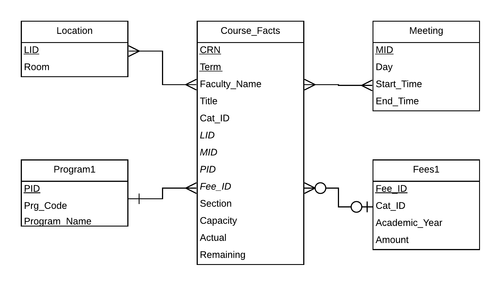

# Charles F. Dolan School of Business

# BA 510 – Final Project, SP 2019

## Team New

**Goal:** 
- The goal of this project was to Extract, translate, and load data into a normalized database
- Design and populate a  data warehouse designed to address our analytical questions
- Test your databases to ensure domain, entity, relational integrity

**Explanation of Work: Part 1) Database**
- We began by creating a normalized ERD for our DataBase:
 
[CoursesDatabaseERD](CoursesDatabaseERD.png)
  We also created a Data Dictionary for our ERD:
**[DataBaseDataDictionary](CourseDataDictionary.md)**

- We then built our database; we mainly used SQLITE3 but also used Pandas to read all the CSV files quickly and add a column explaining the catalog year.
**[Creating Database](CourseDataETL.ipynb)**
*PLease note at the end of the file we delete all the tables and vacuum the database in order to allow us to commit to GitHub. Do not run this code if you want to query the database*

- We queried and tested our database using the following file
**[Testing Database](CourseDataTests.ipynb)**

 **Part 2) DataWarehouse**
 - We began by creating an ERD for our DataWarehouse:
 
[CourseDataWarehouseERD](CourseDataWarehouseERD.png)
  We also created a Data Dictionary for our ERD:
**[DataWarehouseDataDictionary](CourseDataWarehouseDictionary.md)**

