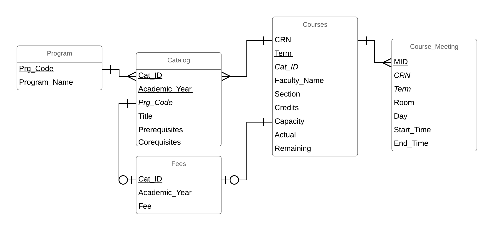

# Charles F. Dolan School of Business

# BA 510 – Final Project, SP 2019

## Team New

**Goal:** 
- The goal of this project was to Extract, translate, and load data into a normalized database
- Design and populate a  data warehouse designed to address our analytical questions
- Test your databases to ensure domain, entity, relational integrity

**Explanation of Work:**
- We began by creating a normalized ERD for our DataBase:
 
**[CoursesDatabaseERD](CoursesDatabaseERD.png)**
  We also created a Data Dictionary for our ERD:
**[DataBaseDataDictionary](CourseDataDictionary.md)

